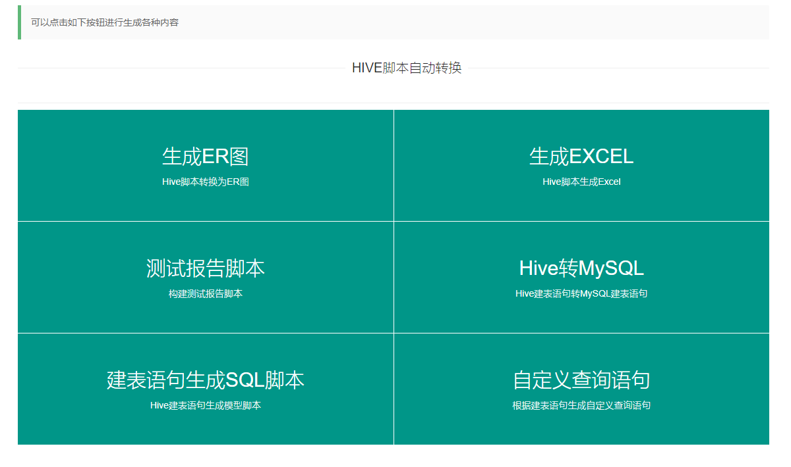
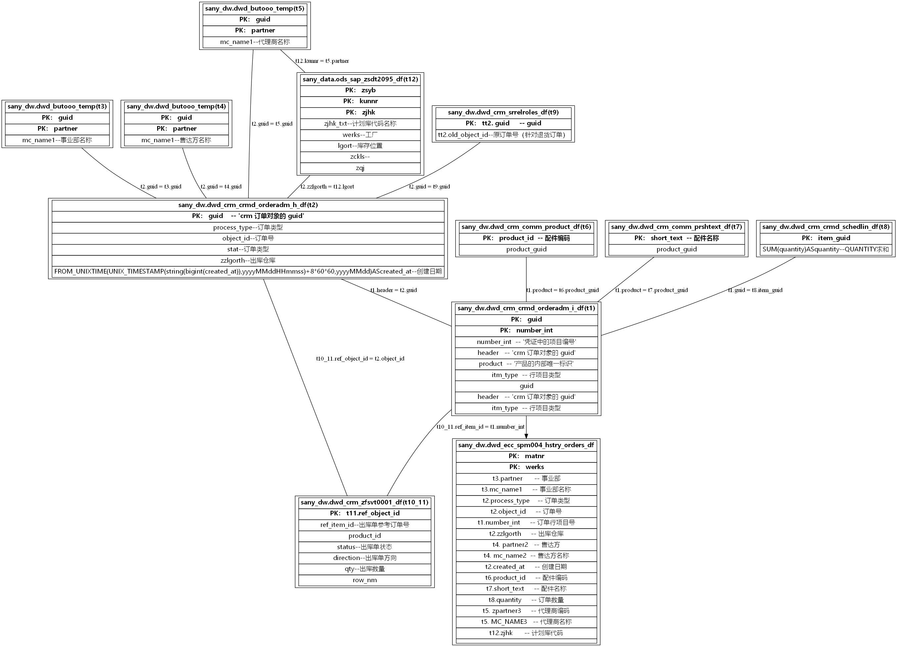

# Hql&Sql 脚本处理工具及自动生成Hql代码

## HqlParse

解析SQL脚本，可以解析两种SQL脚本：
1. 建表语句（CREATE），能获取表名，字段名，字段属性、表注释
2. INSERT 语句，能获取目标表，目标表字段，主表，主表字段，子表，子表字段以及所有的关联关系。

## HqlToER

将 Hql脚本转换为ER图，展示各个表之间的关联关系

## HqlToExcel

将 Hql脚本转换为Excel表格，输出表的字段，表名，来源表、关联关系

## HqlBuilder

根据 HQL脚本生成各种脚本，减少重复工作，

- 生成校验发散的脚本；
- 生成测试报告所需脚本：检查乱码、检查数据发散，检查；
- hive建表语句转MySQL建表语句
- 批量生成查询语句
- 根据建表语句自动生成维度退化代码
- 多表UNION ALL
- 多表JOIN 去重

## 开始使用

### 安装步骤

1. 安装Python开发环境（`3.7.2`以上）
2. 安装 graphviz （`sudo yum install graphviz` 、 `pip3 install graphviz`）
3. 安装 flask （`pip3 install flask`）
4. 安装openpyxl（`pip3 install openpyxl`）
5. 安装 gevent (`pip3 install gevent`)
6. 安装sqlparse（`pip3 install sqlparse`）

- 如果在Linux下部署，需要修改代码中的文件保存路径，`app.py` 、`Hive_2_Excel.py`、`HiveToEr.py` ，将这三个文件中的Windows路径改为Linux路径
- 另外第一次部署，生成ER图可能会存在乱码问题，解决办法是将Windows下的微软雅黑字体复制到Linux的 `/usr/share/fonts/ZH_CN` 目录下。

安装完上述库之后即可使用命令： `python3 app.py`启动
后台执行可以使用： `nohup python3 app.py >/dev/null 2>&1 &`

### 功能介绍：

软件功能界面如下所示。

